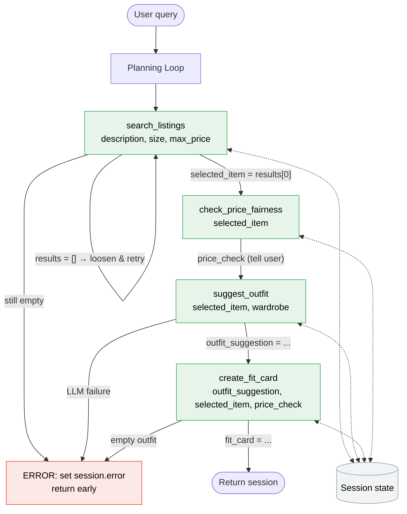

# FitFindr — planning.md

> Complete this document before writing any implementation code.
> Your spec and agent diagram are what you'll use to direct AI tools (Claude, Copilot, etc.) to generate your implementation — the more specific they are, the more useful the generated code will be.
> Your planning.md will be reviewed as part of your submission.
> Update it before starting any stretch features.

---

## Tools

List every tool your agent will use. For each tool, fill in all four fields.
You must have at least 3 tools. The three required tools are listed — add any additional tools below them.

### Tool 1: search_listings

**What it does:**
Searches the listings dataset for secondhand items (in data/listings.json) matching a keyword description, optionally filtered by size and a maximum price. It scores each candidate by keyword overlap with the description, drops non-matches, and returns the listings sorted best-match first.

**Input parameters:**
<!-- List each parameter, its type, and what it represents -->
- `description` (str): this is the keywords describing what the user is looking for; used to score each listing by keyword overlap.
- `size` (str, optional): a size string we can use to filter listings. Matching is case-insensitive and substring-aware, so `"M"` matches `"S/M"`. When `None`, no size filtering is applied.
- `max_price` (float, optional): the maximum price (inclusive) a listing may cost. Listings priced above this are dropped. When `None`, no price filtering is applied.

**What it returns:**
<!-- Describe the return value — what fields does a result contain? -->
search_listings returns a list of dictionary (`list[dict]`) of matching listings, sorted by relevance (best keyword-overlap match first), or an empty list if nothing matches.

Each dict item in the returned list contains the following fields:
- `id` (str): unique listing identifier
- `title` (str): short listing title
- `description` (str): free-text description of the item
- `category` (str): item category (e.g. top, bottoms)
- `style_tags` (list[str]): style descriptors (e.g. vintage, graphic)
- `size` (str): listing size (e.g. S, S/M)
- `condition` (str): item condition (e.g. good, like new)
- `price` (float): listing price in dollars
- `colors` (list[str]): dominant colors of the item
- `brand` (str): brand name, if known
- `platform` (str): source marketplace the listing came from

For example: `search_listings("vintage graphic tee", size="M", max_price=30.0)` would return some matching listings with the above fields, sorted by relevance. 


**What happens if it fails or returns nothing:**
<!-- What should the agent do if no listings match? -->
search_listings always returns a list; an empty list means nothing matched the current constraints. Rather than giving up immediately, the agent applies retry logic with fallback: when the first call returns an empty list, it automatically re-runs the search with progressively loosened constraints and tells the user what it adjusted.

The retry ladder loosens one constraint at a time, from most to least restrictive, keeping the `description` (the user's core intent) for as long as possible:
1. First attempt: `description` + `size` + `max_price` (all constraints).
2. If empty → get the closest smaller size if available, and the closest larger size if available, and retry. Note: "No exact match in your size, so I broadened to [the two closest sizes]"
3. If still empty → relax `max_price` by raising it by ~20% and retry. Leave a note to user as: "Nothing under $X, so I widened the price range to $X*20%."
4. If still empty → keyword-only search on `description` with no filters.

Each retry records what was adjusted in session state so the agent can surface a transparent note besides the results (e.g. "I couldn't find a size M under $30, so here are vintage graphic tees in S or L up to $36"). The first non-empty result would stop the search loop, and the chain continues to the next step, `suggest_outfit`, with that listing.

Only if the final keyword-only fallback also returns an empty list does the agent stop the chain early, it then sets the session's `error` field to a helpful "no results" message (e.g. "No vintage graphic tees in the dataset right now, try a different style or keyword") and surfaces it to the user instead of moving the next step - `suggest_outfit` or `create_fit_card`. The loosened constraints used during retries are also stored in session state so later tools and the user-facing summary stay consistent with what was actually searched.

---

### Tool 2: suggest_outfit

**What it does:**
<!-- Describe what this tool does in 1–2 sentences -->
Takes a thrifted item the user is considering, plus the user's existing wardrobe, and asks the LLM to suggest 1–2 complete outfits that style the new item with named pieces from the wardrobe (what to pair with, how to style them, etc.). If the wardrobe is empty, fall back to general styling advice for the item on its own rather than raising an exception or returning an empty string

**Input parameters:**
<!-- List each parameter, its type, and what it represents -->
- `new_item` (dict): a single listing dict (the item the user is considering buying, selected from the returned list of `search_listings`); used to describe the new piece to the LLM
- `wardrobe` (dict): the user's existing closet, which is a dict with an `items` key holding a list of wardrobe item dicts. Each item has fields: `id`, `name`, `category`, `colors` (list[str]), `style_tags` (list[str]), and an optional `notes` string. If the `items` list is empty, it means user doesn't have a waredrobe in our database

**What it returns:**
<!-- Describe the return value -->
A non-empty string of natural-language outfit suggestions from the LLM. When the wardrobe has items, the string names specific pieces from it (e.g. "pair it with your baggy dark-wash jeans and chunky white sneakers", "Pair this with your wide-leg jeans and platform Docs for a classic 90s grunge look. Roll the sleeves once and tuck the front corner slightly for shape."); when the wardrobe is empty, the string is general styling advice for the item (what pairs well, what vibe it suits).


**What happens if it fails or returns nothing:**
<!-- What should the agent do if the wardrobe is empty or no outfit can be suggested? -->
suggest_outfit should degrade gracefully rather than crashing. Even when `wardrobe['items']` is empty, the tool does not throw exception or error, but returns general styling advice for the item instead of wardrobe-specific combinations, so the chain still continues to `create_fit_card`. It always returns a non-empty string.

However, if an LLM call fails, the agent should set the session `error` field with a "styling unavailable" message and surface it to the user rather than passing an empty string downstream to `create_fit_card`

---

### Tool 3: create_fit_card

**What it does:**
<!-- Describe what this tool does in 1–2 sentences -->
Takes the outfit suggestion from `suggest_outfit`, the thrifted item, and optionally the price verdict from `check_price_fairness`, and asks the LLM to write a short (2–4 sentence), shareable OOTD string caption using Instagram/TikTok style (e.g. "thrifted this faded band tee off depop for $22 and honestly it was made for my wide-legs 🖤 full look in my stories"). If a useful price verdict is available, the caption can naturally weave it in (e.g. referencing it as a good deal).

The caption should:
- Feel casual and authentic (like a real OOTD post, not a product description)
- Mention the item name, price, and platform naturally (once each)
- Capture the outfit vibe in specific terms
- Optionally note the price verdict if it is "good deal" or "overpriced" (skip if "fair" or "insufficient data")
- Sound different each time for different inputs (use higher LLM temperature)

If outfit is empty or missing, it returns a descriptive error message string instead of raising an exception.

**Input parameters:**
<!-- List each parameter, its type, and what it represents -->
- `outfit` (str): the outfit suggestion string produced by `suggest_outfit`, describing how the item is styled. This is the basis for the caption's vibe.
- `new_item` (dict): the listing dict for the selected thrifted item (chosen from the returned list of search_listings), in the same shape `search_listings` returns. This can be used to pull the item name (`title`), `price`, and `platform` into the caption.
- `price_check` (dict | None, optional): the verdict dict returned by `check_price_fairness`. If available and the verdict is `"good deal"` or `"overpriced"`, the caption can weave in a brief pricing note. If `None` or `"insufficient data"` or `"fair"`, the caption skips the pricing reference.

**What it returns:**
<!-- Describe the return value -->
A 2–4 sentence string usable as a social-media caption. It reads like a real OOTD post, mentions the item name, price, and platform once each, and captures the outfit vibe in specific terms. Generated with a higher LLM temperature so it sounds different each time for different inputs.

**What happens if it fails or returns nothing:**
<!-- What should the agent do if the outfit data is incomplete? -->
The tool does not raise exeption. It guards against an empty or whitespace-only `outfit` string (or missing item data). In that case it returns a descriptive error message string rather than a caption, so the agent can set the session `error` field and surface it to the user. On the normal path it always returns a non-empty caption, which completes the interaction.

---

### Additional Tools (if any)

<!-- Copy the block above for any tools beyond the required three -->
#### Tool 4: add_to_wardrobe

**What it does:**
Add an item into the user user's wardrobe database by adding an item into the `items` list of the "empty_wardrobe" dict in data/waredrobe_schema.js. An item added to waredrobe can be:
- (1) the new thrifted item user chose. In this case, use the schema that `suggest_outfit` expects, so a thrifted find the user decides to "keep" becomes part of their closet for future styling sessions.
- (2) an item user describes they already has in their wardrobe

**Input parameters:**
- `item` (dict): the listing dict for the item to save (mapped into the wardrobe item shape: `id`, `name`, `category`, `colors`, `style_tags`, optional `notes`).
- `wardrobe` (dict): the current wardrobe dict to append to. This is a dict with an `items` key holding a list of wardrobe item dicts. Each item has fields: `id`, `name`, `category`, `colors` (list[str]), `style_tags` (list[str]), and an optional `notes` string. If the `items` list is empty, it means user doesn't have a waredrobe in our database

**What it returns:**
The updated `wardrobe` dict with the new item added to its `items` list, plus a confirmation string.

**What happens if it fails or returns nothing:**
If the item is missing required fields (`name`/`category`), it returns a descriptive error and leaves the wardrobe unchanged. If a duplicate `id` already exists, it skips the add and reports it rather than creating a duplicate.


#### Tool 5: check_price_fairness

**What it does:**
Given an item, estimates whether its price is fair by comparing it against comparable listings in the dataset. It pulls similar items (same `category`, overlapping `style_tags`/keywords, and roughly similar `condition`), computes their price distribution, and judges whether the item is a good deal, about average, or overpriced relative to those comparables.

**Input parameters:**
- `item` (dict): the listing dict to evaluate (the item the user is considering), in the same shape `search_listings` returns. Its `category`, `style_tags`, `condition`, and `price` drive the comparison.
- `max_comparables` (int, optional, default 10): the maximum number of comparable listings to use when estimating the fair price range.

**What it returns:**
A dict summarizing the price check, e.g.:
- `verdict` (str): one of `"good deal"`, `"fair"`, `"overpriced"`, or `"insufficient data"`
- `item_price` (float): the item's own price, echoed back.
- `comparable_count` (int): how many comparable listings were found.
- `median_price` (float): median price of the comparables.
- `price_range` (tuple[float, float]): the (min, max) of the comparables.
- `explanation` (str): a short human-readable rationale (e.g. "At $22 this sits below the $28 median for vintage tees in good condition — a solid deal").

**What happens if it fails or returns nothing:**
If too few comparables are found (e.g. fewer than 2), it cannot reliably judge fairness and returns a `verdict` of `"insufficient data"` with an explanation, rather than guessing or raising. If the item is missing a `price`, it returns a descriptive error string. It never raises, the agent can surface the verdict alongside the listing or skip it on insufficient data.


---

## Planning Loop

**How does your agent decide which tool to call next?**
<!-- Describe the logic your planning loop uses. What does it look at? What conditions change its behavior? How does it know when it's done? -->

The planning loop is **state-driven**: after each tool call it inspects the session state (what's already filled in, whether `error` is set) and picks the next tool. The three required tools (`search_listings → suggest_outfit → create_fit_card`) form a fixed backbone; the two additional tools (`check_price_fairness`, `add_to_wardrobe`) are optional branches the loop takes when their precondition is met. At any point, if a tool sets the session `error` field (a hard failure), the loop stops and surfaces that message instead of continuing.

The agent first parses the user's natural-language query into `description`, `size`, and `max_price` (this happens up front, before the loop's tool steps). The decision order for each iteration is:

1. **After the agent parsed the user query to get search params (`description`, `size`, and `max_price`) but doesn't haven't search for related listings**, it's gonna call `search_listings` with `description` + `size` + `max_price`.
   - If `search_listings` returns an empty list, the loop re-runs `search_listings` using the retry-with-fallback ladder (broaden to the closest sizes first → then relax price by ~20% → then loosen to keyword-only), while recording each adjustment in session state. Only if every fallback is still empty does it set `error` and stop before `suggest_outfit`.
2. **When agent has the searched listings but no item selected yet** → automatically pick the top-ranked listing and set it as `new_item`.
3. **Once `new_item` has been selected**, call `check_price_fairness` on the selected item. This is non-blocking; on `"insufficient data"` verdict the loop just skips the price note and continues.
4. **When the agent has a selected `new_item`, but no outfit advice has been suggested yet**, call `suggest_outfit` with the new_item and the user's wardrobe (loaded at startup). If user has an empty wardrobe, the agent should still return general styling advice, so the loop continues rather than stopping.
5. **When the outfit suggestion is ready**, automatically call `create_fit_card` with the outfit suggestion + the picked item + the judgement returned from `check_price_fairness`. This is the terminal step on the happy path.

**How it knows it's done:** the loop terminates in one of these conditions:
- (1) a fit card has been produced (success)
- (2) the session's `error` field gets set on an early exit (e.g. no results after all retries, or an LLM failure in `suggest_outfit`/`create_fit_card`).
Each conditional above is gated on a piece of session state being present or absent, so the loop never repeats a completed step and never calls a downstream tool before its input exists.

---

## Planning Loop — Technical Spec (implementation-level)
(prompt used to generate this section: for the planning loop, i want it to be more technically specific, for example: "After search_listings runs, check if results is empty. If yes, set an error message in the session and return early. If no, set selected_item = results[0] and proceed to suggest_outfit." Your description should be specific enough that someone else could implement it from your words alone. Please do not touch the existing planning loop content, but make a second Planning loop section under the existing one and write your updated plan there)

This is the precise, step-by-step version of the loop above, written so it can be implemented directly. The agent keeps a `session` dict and runs the loop until `session["done"]` is true.

**Session fields used here:** `description`, `size`, `max_price`, `listings`, `adjustments`, `selected_item`, `price_check`, `wardrobe`, `outfit_suggestion`, `fit_card`, `error`, `done`.

```
# --- Setup (before the loop) ---
session = {
    "description": None, 
    "size": None, 
    "max_price": None,
    "listings": None, 
    "adjustments": [], 
    "selected_item": None,
    "price_check": None, 
    "wardrobe": load_wardrobe(),  # {"items": [...]}, may be empty
    "outfit_suggestion": None, 
    "fit_card": None, "error": None, "done": False,
}

# Parse the raw user query into search params. Fill description; size/max_price may be None.
session["description"], session["size"], session["max_price"] = parse_query(user_message)
if not session["description"]:
    session["description"] = user_message   # fallback: use raw text, no structured filters

# --- Loop ---
while not session["done"]:

    # STEP 1: search (only if we have params but no listings yet)
    if session["listings"] is None:
        results = search_listings(session["description"], session["size"], session["max_price"])

        # Retry-with-fallback ladder: stop at the first non-empty result.
        if not results:
            # 1a. broaden to the closest smaller + closest larger sizes
            for s in closest_sizes(session["size"]):
                results = search_listings(session["description"], s, session["max_price"])
                if results:
                    session["adjustments"].append(f"No size {session['size']}, broadened to {s}")
                    break
        if not results and session["max_price"] is not None:
            # 1b. relax price by +20%
            loosened = round(session["max_price"] * 1.20, 2)
            results = search_listings(session["description"], session["size"], loosened)
            if results:
                session["adjustments"].append(f"Nothing under ${session['max_price']}, widened to ${loosened}")
        if not results:
            # 1c. keyword-only, no filters
            results = search_listings(session["description"], None, None)
            if results:
                session["adjustments"].append("Dropped all filters; searched by keywords only")

        # If every fallback is still empty -> hard stop.
        if not results:
            session["error"] = "No listings matched — try a different style or keyword."
            session["done"] = True
            continue

        session["listings"] = results
        continue   # re-enter loop; listings now set

    # STEP 2: select an item (only if listings exist but none chosen yet)
    if session["selected_item"] is None:
        # always pick the top-ranked listing automatically
        session["selected_item"] = session["listings"][0]
        continue

    # STEP 3: price-fairness check (non-blocking; run once)
    if session["price_check"] is None:
        session["price_check"] = check_price_fairness(session["selected_item"])
        # on "insufficient data" -> just skip the price note; do NOT stop.
        continue

    # STEP 4: outfit suggestion (only if not produced yet)
    if session["outfit_suggestion"] is None:
        outfit_suggestion = suggest_outfit(session["selected_item"], session["wardrobe"])
        if not outfit_suggestion:                       # LLM failure
            session["error"] = "Styling unavailable right now — please try again."
            session["done"] = True
            continue
        session["outfit_suggestion"] = outfit_suggestion
        continue

    # STEP 5: create fit card automatically and finish
    if session["fit_card"] is None:
        card = create_fit_card(session["outfit_suggestion"], session["selected_item"], session["price_check"])
        if is_error_string(card):        # empty/invalid outfit guard
            session["error"] = card
        else:
            session["fit_card"] = card   # terminal success
        session["done"] = True
        continue

# --- Termination ---
# done == True means exactly one of:
#   session["fit_card"] is set   -> success, show the card (+ adjustments / price_check)
#   session["error"] is set      -> show the error message
```

**Why each guard exists:** every `if session[X] is None` check makes the step idempotent — a completed step is skipped on the next iteration because its output field is now populated. In single-turn mode the loop runs straight through Steps 1–5 without pausing for user input; each step fires exactly once and the session is returned when `done` is set.

---

## State Management

**How does information from one tool get passed to the next?**
<!-- Describe how your agent stores and accesses state within a session. What data is tracked? How is it passed between tool calls? -->

Tools do **not** call each other directly. Instead the agent holds a single **session state object** (a dict) for the whole interaction. Each tool reads its inputs from that object and the agent writes the tool's output back into it, so state is the only thing passed between steps. The planning loop reads this object after every tool call to decide what to do next (see Planning Loop above), which is why each step is gated on whether a given field is present.

**What the session tracks:**

| Field | Written by | Read by | Holds |
|-------|-----------|---------|-------|
| `description`, `size`, `max_price` | query parsing (up front) | `search_listings` | the structured search params extracted from the user's message |
| `adjustments` | `search_listings` retry ladder | user-facing summary | a record of any loosened constraints (e.g. "broadened size M → S/L", "raised price to $36") so the summary stays honest about what was actually searched |
| `listings` | `search_listings` | item selection, `check_price_fairness` | the returned `list[dict]` of matches |
| `new_item` | item selection (top match) | `suggest_outfit`, `create_fit_card`, `check_price_fairness` | the single chosen listing dict |
| `price_check` | `check_price_fairness` | `create_fit_card`, user-facing summary | the verdict dict (good deal / fair / overpriced / insufficient data) |
| `outfit` | `suggest_outfit` | `create_fit_card` | the outfit-suggestion string |
| `fit_card` | `create_fit_card` | final output | the shareable caption string (terminal success value) |
| `wardrobe` | loaded at start | `suggest_outfit` | the user's closet dict (`{"items": [...]}`) |
| `error` | any tool on hard failure | planning loop / final output | a user-facing error message; when set, the loop stops early |

**How it flows, concretely:** query parsing fills `description`/`size`/`max_price` → `search_listings` reads those and writes `listings` (plus `adjustments` if it had to retry) → the agent picks `new_item` from `listings` → `check_price_fairness` reads `new_item` and writes `price_check` → `suggest_outfit` reads `new_item` + `wardrobe` and writes `outfit` → `create_fit_card` reads `outfit` + `new_item` + `price_check` and writes `fit_card`. The key handoff is the **`new_item` dict**: because `search_listings` returns full listing dicts (with `title`, `price`, `platform`, etc.), the same object flows unchanged into every downstream tool, so no information is re-fetched or lost between steps. `price_check` flows from `check_price_fairness` all the way to `create_fit_card` so the caption can optionally reflect the deal quality.

Any tool that fails sets `error` instead of its normal output field, and the loop checks `error` before advancing.

---

## Error Handling

For each tool, describe the specific failure mode you're handling and what the agent does in response.

| Tool | Failure mode | Agent response |
|------|-------------|----------------|
| search_listings | No results match the query | Run the retry-with-fallback ladder: broaden to the closest sizes → relax `max_price` by ~20% → keyword-only with no filters, recording each loosened constraint in `session["adjustments"]`. The first non-empty result wins and the chain continues. Only if every fallback is still empty does the agent set `session["error"]` to a "no results — try a different style/keyword" message and stop before `suggest_outfit`. |
| suggest_outfit | Wardrobe is empty | Do not error or stop. The tool falls back to general styling advice for the item on its own and still returns a non-empty string, so the loop continues to `create_fit_card`. (Separately, if the underlying LLM call itself fails, set `session["error"]` to a "styling unavailable" message instead of passing an empty string downstream.) |
| create_fit_card | Outfit input is missing or incomplete (empty `outfit_suggestion` or missing item fields) | Guard before calling the LLM. Instead of raising, return a descriptive error string; the agent detects it (`is_error_string`) and sets `session["error"]` so the user sees a clear message rather than a broken/empty caption. |
| check_price_fairness | Too few comparable listings to judge fairly (fewer than ~2) | Return a `verdict` of `"insufficient data"` with an explanation rather than guessing or raising. The loop treats this as non-blocking: it simply skips the price note and continues to `suggest_outfit`. (If the item is missing a `price`, return a descriptive error string.) |
| add_to_wardrobe | Item missing required fields (`name`/`category`), or duplicate `id` | Leave the wardrobe unchanged and return a descriptive message. On missing fields, report what's needed; on a duplicate `id`, skip the add and report it rather than creating a duplicate. This is non-fatal, it does not set `session["error"]` or stop the loop. |

---

## Architecture

<!-- Draw a diagram of your agent showing how the components connect:
     User input → Planning Loop → Tools (search_listings, suggest_outfit, create_fit_card)
                                                                          ↕
                                                                   State / Session
     Show what triggers each tool, how state flows between them, and where error paths branch off.
     ASCII art, a Mermaid diagram (https://mermaid.js.org/syntax/flowchart.html), or an embedded
     sketch are all fine. You'll share this diagram with an AI tool when asking it to implement
     the planning loop and each individual tool. -->

The Planning Loop drives the three tools in order. Each tool reads from and writes to the shared **Session state**; arrows are labeled with the call made or the state written. Any tool failure branches to the red **ERROR** node and returns early.



**How to read it:** the User query enters the Planning Loop, which calls the tools in sequence. `search_listings` **self-loops** on empty results to retry with loosened filters; only if every fallback is still empty does it branch to **ERROR**. After a match, `check_price_fairness` notes whether the price is fair, then `suggest_outfit` runs, and finally `create_fit_card` produces the caption — all automatically in a single pass. Dashed arrows show every tool reading/writing the shared Session state; any failure (no listings, LLM error, empty outfit) sets `session.error` and returns early.

---

## AI Tool Plan

<!-- For each part of the implementation below, describe:
     - Which AI tool you plan to use (Claude, Copilot, ChatGPT, etc.)
     - What you'll give it as input (which sections of this planning.md, your agent diagram)
     - What you expect it to produce
     - How you'll verify the output matches your spec before moving on

     "I'll use AI to help me code" is not a plan.
     "I'll give Claude my Tool 1 spec (inputs, return value, failure mode) and ask it to implement
     search_listings() using load_listings() from the data loader — then test it against 3 queries
     before trusting it" is a plan. -->

**Milestone 3 — Individual tool implementations:**

- **search_listings:** I'll give Claude the 'Tool 1' block from planning.md, plus its function prototype and description in `tools.py`, and ask it to implement the function using `load_listings()` from `utils/data_loader.py`. Before running it, I'll check that the generated code filters by all three parameters (`description`, `size`, `max_price`), scores by keyword overlap, drops zero-score listings, and returns an empty list (not an error) when nothing matches. I'll test it with 3 queries: one that matches, one with a size that doesn't exist, and one with a tiny `max_price` to make sure the empty case works. Note that the retry-with-fallback ladder lives in the planning loop, not in this function, the tool should just returns a plain list.

- **suggest_outfit:** I'd build the LLM prompt and ask Claude to enhance it. Once i'm happy with the prompt, I'll give Claude the 'Tool 2' block from planning.md + the wardrobe schema + suggest_outfit prototype and description in `tools.py` + the LLM prompt i just buid, and ask it to build the function and call the Groq client that's already set up in `tools.py`. I'll verify it handles both cases:
     - (1) a wardrobe with items (names specific pieces)
     - (2) an empty wardrobe from `get_empty_wardrobe()` (falls back to general advice)
The function should always returns a non-empty string in both cases

- **create_fit_card:** I'd create the caption prompt and ask Claude to enhance it. Then, I'd give Claude the "Tool 3" block and ask it to implement the function using variances of the caption prompt I build (with higher temperature so it's different everytime). I'll check that it handles an empty `outfit` input case by returning an error string instead of raising exception, and that the caption mentions the item name, price, and platform. I'll test it with a normal outfit and with an empty string.

- **add_to_wardrobe:** I'll give Claude the Tool 4 block and the wardrobe schema, and ask it to map a listing dict into the wardrobe item shape (`id`, `name`, `category`, `colors`, `style_tags`, optional `notes`) and append it to `wardrobe["items"]`. I'll verify it returns the updated wardrobe plus a confirmation, leaves the wardrobe unchanged if required fields like `name`/`category` are missing, and skips duplicates by `id`. I'll test it by adding one item, adding the same item again (duplicate), and passing an item with no `name`.

- **check_price_fairness:** I'll give Claude the 'Tool 5' block and ask it to pull comparable listings from `load_listings()` (same category, overlapping style tags, similar condition), compute the median and min/max prices, and return the verdict dict. I'll check that it returns `"insufficient data"` when there are fewer than ~2 comparables instead of guessing, and that the verdict actually matches the numbers. I'll test it with an item that has lots of comparables and one that is unique.


**Milestone 4 — Planning loop and state management:**

- I'll give claude all necessary context like the the "Planning Loop" section (both the literal and the Technical Spec versions), the "State Management" table, and the "Architecture diagram" from planning.md, plus the `run_agent()` and `_new_session()` prototype in `agent.py`.
- I'll ask it to turn the pseudocode into the real `run_agent()` loop, including building the session dict, calling the tools in the right order, and gating each step on whether a session field is set (so no step repeats and no tool runs before its input exists).
- To verify, I'll run the full example query end-to-end and confirm I get a fit card, then run a query that matches nothing and confirm it stops early with a clean error message instead of crashing. I'll also track the session dict at each step to make sure data is being passed through state, not hard-coded between calls.


---

## A Complete Interaction (Step by Step)

**What FitFindr needs to do:** 
- FitFindr is a multi-tool AI agent that helps users search, compare secondhand pieces, evaluate the fit against their waredrobe, and, at the end, generate a shareable outfit description. 

- In general, the user describes what they're looking for in natural-language thrifting query, and FitFindr would parses out infomation about description, size, and max price, then chains three tools in order:
    - (1) search_listings: to find matching secondhand listings
    - (2) suggest_outfit: suggest how to style the one selected listing with the user's existing wardrobe
    - (3) create_fit_card: generates a shareable outfit description 

- Each tool degrades gracefully rather than crashing: 
     - if `search_listings` returns no matches the agent retries with loosened constraints (drop size, then relax price, then keyword-only) and tells the user what it adjusted; only if every fallback is still empty does the loop stop early and return a helpful "no results" error without calling the later tools
     - if the wardrobe is empty `suggest_outfit` falls back to general styling advice for the item
     -  if the outfit string is empty or missing `create_fit_card` returns a descriptive error string.
- The interaction is complete when a fit card is produced, or when the session's `error` field is set on an early exit.


---


Write out what a full user interaction looks like from start to finish — tool call by tool call. Use a specific example query.

**Example user query:** "I'm looking for a vintage graphic tee under $30. I mostly wear baggy jeans and chunky sneakers. What's out there and how would I style it?"

**Step 0 — Parse the query (before the loop):**
The agent reads the message and pulls out the search params, writing them to the session:
- `description = "vintage graphic tee"`, `size = None` (the user didn't give one), `max_price = 30.0`.
It also loads the user's wardrobe into `session["wardrobe"]`. From the message ("baggy jeans and chunky sneakers"), the wardrobe already has items like "baggy dark-wash jeans" and "chunky white sneakers".

**Step 1 — search_listings:**
The loop sees `session["listings"]` is None, so it calls `search_listings("vintage graphic tee", size=None, max_price=30.0)`
This returns a non-empty list, e.g. `[{"id": "L_012", "title": "Faded Nirvana band tee", "price": 22.0, "platform": "Depop", "size": "M", "condition": "good", ...}, {...}]`, sorted best-match first. The agent writes it to `session["listings"]`. 

**Step 2 — select an item:**
`session["selected_item"] is None`, so the agent automatically picks the top-ranked listing and sets `session["selected_item"] = listings[0]` (e.g. the $22 "Faded Nirvana band tee" from Depop).

**Step 3 — check_price_fairness:**
`session["price_check"] is None`, so the agent calls: `check_price_fairness(selected_item)` -> It pulls comparable vintage tees in good condition from the dataset, finds the median is ~$28, and returns `{"verdict": "good deal", "median_price": 28.0, "explanation": "At $22 this sits below the $28 median for vintage tees in good condition — a solid deal"}`. The agent tells the user this and writes it to `session["price_check"]`

**Step 4 — suggest_outfit:**
`session["outfit_suggestion"] is None`, so the agent calls `suggest_outfit(selected_item, wardrobe)`. Since the wardrobe has items, the LLM names specific pieces: e.g. "Pair the faded band tee with your baggy dark-wash jeans and chunky white sneakers for an easy 90s-grunge look — tuck the front hem for shape." This string goes into `session["outfit_suggestion"]`.

**Step 5 — create_fit_card:**
The agent automatically calls `create_fit_card(outfit_suggestion, selected_item, price_check)`. Because the price check returned `"good deal"`, the LLM has context to weave that into the caption naturally. This returns something like: "thrifted this faded band tee off depop for $22 — honestly a steal — and it was made for my wide-legs 🖤 full look in my stories". This goes into `session["fit_card"]`, which is the terminal success value.

**Final output to user:**
<!-- What does the user actually see at the end? -->
The agent runs all steps in a single pass and returns the results all at once across three panels:
1. **Top listing found** — the matched item with price, platform, size, condition, and the price-fairness note (e.g. "Faded Nirvana band tee — $22 on Depop (size M, good condition). Good deal — below the ~$28 median for vintage tees.").
2. **Outfit idea** — the styling suggestion using the wardrobe loaded at startup (e.g. "Pair the faded band tee with your baggy dark-wash jeans and chunky white sneakers for an easy 90s-grunge look — tuck the front hem for shape.").
3. **Fit card** — the shareable caption, optionally reflecting the price verdict (e.g. "thrifted this faded band tee off depop for $22 — honestly a steal — and it was made for my wide-legs 🖤 full look in my stories").

On the early-exit path, if nothing matched at Step 1 even after all retries, only the first panel is populated with a clean error message — "No vintage graphic tees in the dataset right now — try a different style or keyword" — and the other two panels are empty.
